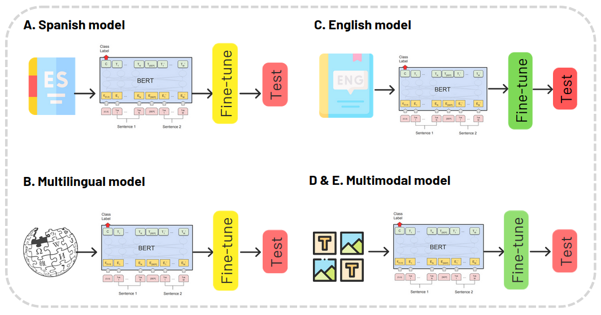

# Semantic Textual Similarity

## Table of Contents (Optional)

- [1. Description](#Description)
- [2. Usage](#usage)
- [3. Results](#Results)
- [4. Data](#Data)
- [5. References](#References)
- [6. License](#license)

## 1. Description

This work investigates how three types of large language models pre-trained on different types of corpora (monolingual, multilingual and multimodal), perform on a Semantic Similarity Task after being fine-tuned on Spanish or English dataset. It finds: 1). A comparable performance between monolingual and multilingual models; 2). A sharp advantage of monolingual models over multimodal models and 3). A similar performance to the state-of-the-art presented in the SemEval-2017 STS shared-task (Cer et al., 2017).




## 2. Usage

The fine-tuned models with the best scores are available at:

 - Multilingual BERT fine-tuned for Spanish: [https://huggingface.co/nflechas/spanish-multilingualBERT-sts](https://huggingface.co/nflechas/spanish-multilingualBERT-sts).
 - Monolingual BERT fine-tuned for Spanish: [https://huggingface.co/nflechas/spanish-BERT-sts](https://huggingface.co/nflechas/spanish-BERT-sts).
 - Monolingual BERT fine-tuned for English: [https://huggingface.co/nflechas/english-BERT-sts](https://huggingface.co/nflechas/english-BERT-sts).

To use any of these models:

    ```
    from transformers import BertTokenizer, AutoModelForSequenceClassification

    tokenizer = BertTokenizer.from_pretrained("nflechas/<MODEL_NAME>")
    model = AutoTokenizer.from_pretrained("bert-base-cased")

    sent_1 = "Replace me by any text you'd like."
    sent_2 = "Same here."
    encoded_input = tokenizer(sent_1, 
                              sent_2, 
                              return_tensors='tf', 
                              model_max_length=512)
    output = model(encoded_input)

    ```
## Results

|                                      | **Pearson’s correlation** | **RMSE** | **Dataset** |
|----------------------------------------------|----------------------------|-----------|-------------|
| **Baseline Spanish (SemEval-2017)**         | 0.856                      | -         | STS-es      |
| **Baseline English (SemEval-2017)**         | 0.855                      | -         | STS-en      |
| **BERT base (GLUE) (Devlin et al., 2019)**  | 0.858                      | -         | STS-en      |
| **BERT large (GLUE) (Devlin et al., 2019)** | 0.865                      | -         | STS-en      |
| **A. Spanish**                              | 0.833                      | 0.684     | STS-es      |
| **B. Multilingual-Es**                          | 0.835                      | 0.663     | STS-es      |
| **C. English**                              | 0.881                      | 0.704     |  STS-en     |
| **D. Multimodal-En**                        | 0.130                      | 1.65      | STS-en      |
| **E. Multimodal-Es**                         | 0.190                      | 1.18      | STS-es      |


## Data

- Spanish STS: [https://huggingface.co/datasets/nflechas/semantic_sentence_similarity_ES](https://huggingface.co/datasets/nflechas/semantic_sentence_similarity_ES)
- English STS: [http://ixa2.si.ehu.eus/stswiki/index.php/STSbenchmark](http://ixa2.si.ehu.eus/stswiki/index.php/STSbenchmark)

## References

- Cer, D.M., Diab, M.T., Agirre, E., Lopez-Gazpio, I., & Specia, L. (2017). SemEval-2017 Task 1: Semantic Textual Similarity Multilingual and Crosslingual Focused Evaluation. International Workshop on Semantic Evaluation.
- Devlin, J., Chang, M., Lee, K., & Toutanova, K. (2019). BERT: Pre-training of Deep Bidirectional Transformers for Language Understanding. ArXiv, abs/1810.04805.
- Wang, A., Singh, A., Michael, J., Hill, F., Levy, O., & Bowman, S.R. (2018). GLUE: A Multi-Task Benchmark and Analysis Platform for Natural Language Understanding. BlackboxNLP@EMNLP.

## License

The MIT License (MIT)
Copyright (c) 2023, Natalia Flechas Manrique
